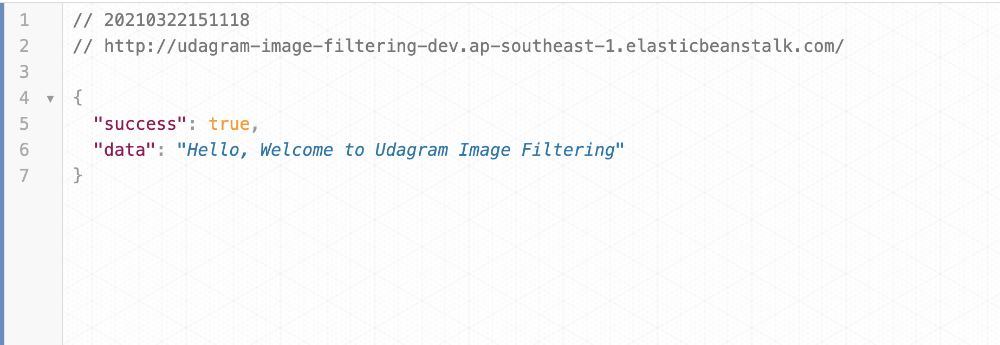
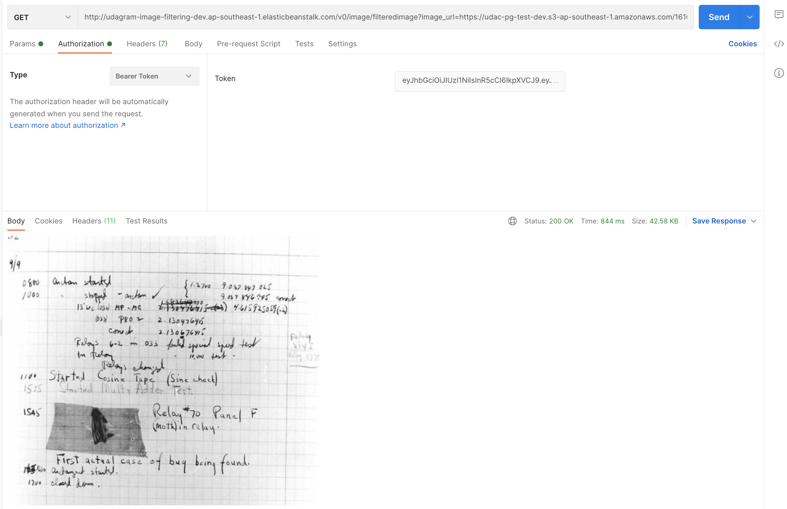

# Udagram Image Filtering

Endpoint has been deployed to [http://udagram-image-filtering-dev.ap-southeast-1.elasticbeanstalk.com/](http://udagram-image-filtering-dev.ap-southeast-1.elasticbeanstalk.com/)



## Post

#### User registration

```bash
{{api}}/v0/users/register
```

body

```json
{
    "email": "xeus_teerapat@test.com",
    "password": "grafana888",
    "fullname": "Xeus Teerapat"
}
```

Example response

```json
{
    "token": "BEARER TOKEN",
    "user": {
        "email": "density_ever@test.com"
    }
}
```

#### User login

```bash
{{api}}/v0/users/login
```

body

```json
{
    "email": "xeus_teerapat@test.com",
    "password": "grafana888"
}

Example response 

```json
{
    "status": "Success",
    "token": "BEARER TOKEN"
}
```

#### Image upload

```bash
{{api}}/v0/image/upload
```

body

```json
select file from form-data
```

Example response

```json
{
    "uploadUrl": "uploaded_url.jpg"
}
```

## GET

#### Process image

```bash
{{api}}/v0/image/filteredimage?image_url=YOUR_IMAGE_URL
```

